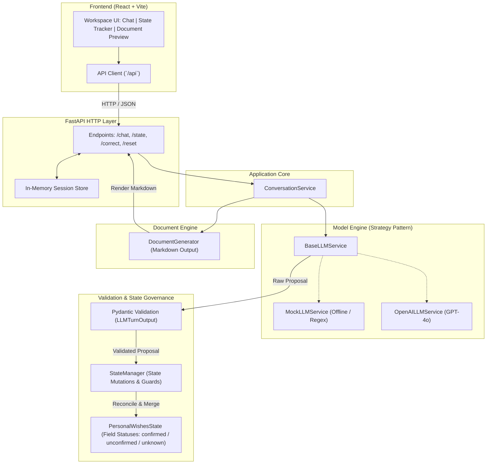

# Document Intake Assistant

A full-stack conversational application for guided personal estate and wishes intake. The application conducts structured intake interviews, validates and reconciles extracted details against a deterministic state model, and renders a live, formatted Markdown document preview alongside the conversation.

---

## Overview

The system is built to ensure complete separation between conversational model reasoning and application state persistence:

- **Frontend**: React 18, TypeScript, Vite, Material UI (MUI), Emotion. Features a 3-pane responsive workspace (Conversation stream, Verified Intake State, and Live Document Preview).
- **Backend**: FastAPI, Python 3.10+, Pydantic v2. Provides strict payload validation, turn-based dialogue coordination, and session state management.
- **State Pipeline**: Model outputs are treated as untrusted mutation proposals. All field mutations, contradiction detections, and status updates are governed authoritatively by `StateManager`.
- **Pluggable Model Architecture**: Operates with an offline, deterministic rule-based engine by default (`MockLLMService`), with native support for live OpenAI Structured Outputs (`OpenAILLMService`).

---

## System Architecture



### Project Layout

```
Document Intake Assistant/
├── backend/
│   ├── app/
│   │   ├── api/                # FastAPI router and HTTP request handlers
│   │   ├── document/           # Markdown document generator and formatting rules
│   │   ├── domain/             # Pydantic schemas (PersonalWishesState, proposals, intents)
│   │   ├── llm/                # Model abstraction, MockLLMService, OpenAILLMService
│   │   ├── services/           # ConversationService flow coordinator
│   │   ├── state_management/   # StateManager mutation engine and contradiction checks
│   │   └── main.py             # FastAPI entrypoint and CORS middleware
│   ├── tests/                  # Pytest suite covering state, regex, API, and validation
│   ├── pytest.ini              # Pytest configuration
│   └── requirements.txt        # Backend dependencies
│
├── frontend/
│   ├── src/
│   │   ├── api/                # Typed fetch client for backend endpoints
│   │   ├── components/
│   │   │   ├── chat/           # ChatPanel, ChatComposer, ChatMessage
│   │   │   ├── common/         # Button, Badge, StatusIndicator, EmptyState
│   │   │   ├── document/       # DocumentPreview, DocumentPreviewPanel
│   │   │   ├── layout/         # AppShell, TopBar, Sidebar, Panel
│   │   │   └── state/          # StatePreviewPanel, StateField, StateSection, JsonViewer
│   │   ├── types.ts            # TypeScript interfaces matching backend models
│   │   ├── theme.ts            # MUI custom theme definitions
│   │   ├── tokens.css          # Design tokens (colors, typography, spacing)
│   │   ├── App.tsx             # Root workspace container and state orchestration
│   │   └── main.tsx            # React application entrypoint
│   ├── index.html
│   ├── package.json
│   ├── tsconfig.json
│   └── vite.config.ts
│
├── TESTING_GUIDE.md            # API verification instructions (curl & Postman)
└── README.md                   # System documentation
```

---

## Quick Start

### Prerequisites

- **Python**: 3.10 or higher
- **Node.js**: 18.0 or higher
- **Package Managers**: `pip` and `npm`

### 1. Backend Setup

From the project root:

```bash
cd backend

# Create and activate virtual environment
python -m venv .venv

# Windows (PowerShell)
.venv\Scripts\Activate.ps1
# macOS / Linux
# source .venv/bin/activate

# Install dependencies
pip install -r requirements.txt

# Start backend server
uvicorn app.main:app --reload --port 8000
```

The backend API will be available at `http://localhost:8000`. Swagger documentation is accessible at `http://localhost:8000/docs`.

### 2. Frontend Setup

In a separate terminal window:

```bash
cd frontend

# Install dependencies
npm install

# Start Vite dev server
npm run dev
```

The frontend interface will open at `http://localhost:5173`. Vite automatically proxies `/api` calls to `http://localhost:8000`.

---

## Running the Test Suite

### Backend Tests (Pytest)

The backend test suite covers entity extraction, schema validation, edge case robustness, contradiction guards, and API contract conformity:

```bash
cd backend
pytest -v
```

### Frontend Build Verification

To verify TypeScript type safety and compile the production bundle:

```bash
cd frontend
npm run build
```

---

## API Specification

All endpoints communicate using standard JSON payloads over HTTP.

### 1. `POST /api/chat`
Processes a user message, executes entity extraction, reconciles the intake state, and returns the assistant response with the updated document draft.

**Request:**
```json
{
  "sessionId": "session-101",
  "message": "My name is Bruce Wayne, living at 100 Wayne Manor. I want my document to cover worldwide assets."
}
```

**Response (`ConversationResponse`):**
```json
{
  "session_id": "session-101",
  "assistant_message": "Understood, I've recorded your name as Bruce Wayne, and updated your address, and confirmed worldwide asset coverage. Who would you like to appoint as the executor of your wishes?",
  "state": {
    "full_name": "Bruce Wayne",
    "home_address": "100 Wayne Manor",
    "covers_worldwide_assets": true,
    "has_children": null,
    "children_names": [],
    "executor": {
      "name": null,
      "relationship": null
    },
    "has_specific_gifts": null,
    "specific_gifts": [],
    "additional_wishes": null,
    "field_statuses": {
      "full_name": "confirmed",
      "home_address": "confirmed",
      "covers_worldwide_assets": "confirmed",
      "has_children": "unknown",
      "children_names": "unknown",
      "executor_name": "unknown",
      "executor_relationship": "unknown",
      "has_specific_gifts": "unknown",
      "specific_gifts": "unknown",
      "additional_wishes": "unknown"
    }
  },
  "history": [
    { "role": "user", "content": "My name is Bruce Wayne..." },
    { "role": "assistant", "content": "Understood, I've recorded..." }
  ],
  "is_complete": false,
  "missing_fields": [
    "has_children",
    "executor_name",
    "executor_relationship"
  ],
  "document_markdown": "# Personal Wishes Document\n...",
  "disclaimer": "This document is prepared for personal documentation and does not constitute formal legal counsel.",
  "error": null
}
```

### 2. `GET /api/state/{session_id}`
Retrieves the accumulated session state, conversation history, and document preview without submitting a new message.

### 3. `POST /api/correct`
Directly updates an individual field value in the active session.

**Request:**
```json
{
  "sessionId": "session-101",
  "field_name": "home_address",
  "value": "42 Elm Street, London"
}
```

### 4. `POST /api/reset/{session_id}`
Clears session history and resets the intake state back to defaults.

### 5. `DELETE /api/sessions/{session_id}`
Permanently removes the specified intake session from the session store. Returns HTTP `204 No Content` on success, or HTTP `404 Not Found` if the session ID does not exist.

### 6. `GET /health`
Liveness check returning `{"status": "ok"}`.

---

## Key Design Principles

### 1. Deterministic State as the Single Source of Truth
Rather than relying on re-parsing the entire conversation history on every turn—which risks token exhaustion and context drift—the application maintains an authoritative state model (`PersonalWishesState`). Each field tracks both its value and its verification status (`confirmed`, `unconfirmed`, or `unknown`).

### 2. Proposal-Verification Pipeline
Model outputs never modify application state directly. Instead, outputs are structured as proposals (`StateProposal`). Pydantic enforces strict type constraints with `extra="forbid"`, rejecting unknown attributes. The `StateManager` reconciles proposals against existing state, applying modifications while guarding against logical contradictions (such as declaring no children while supplying child names).

### 3. Provider Abstraction (Strategy Pattern)
The service layer depends strictly on `BaseLLMService`. The default `MockLLMService` handles end-to-end extraction and conversational steering offline with zero external dependencies. To enable OpenAI integration, set `OPENAI_API_KEY` in the environment and configure `OpenAILLMService`.

---

## Production Roadmap

For enterprise production deployments, the following architectural additions are recommended:

1. **Persistent Storage**: Transition `SessionStore` from in-memory dictionaries to a PostgreSQL database with Redis session caching.
2. **Authentication & RBAC**: Integrate OAuth2 / JWT authentication to scope session records to individual user identities.
3. **Audit Trail**: Record an immutable event log for every state transition and document revision to support compliance auditing.
4. **Export Formats**: Add server-side PDF and DOCX generation alongside the existing Markdown renderer.
